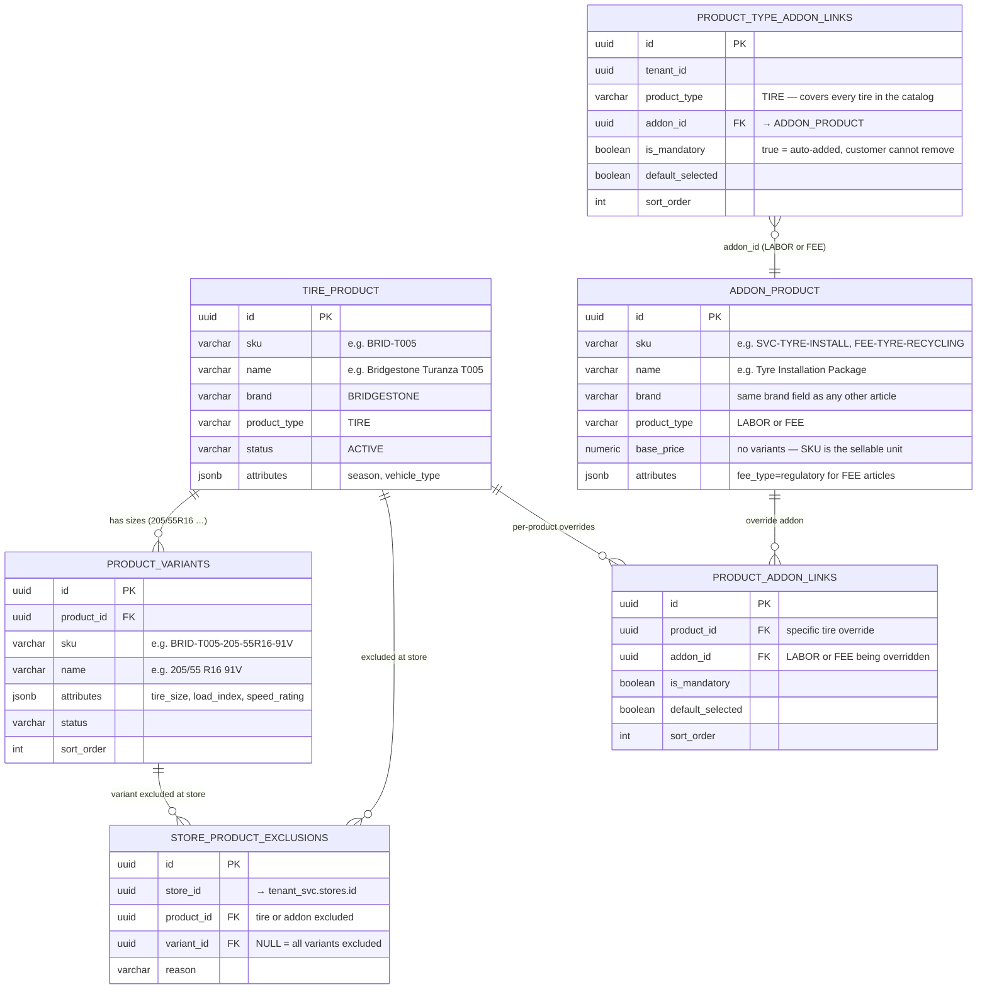
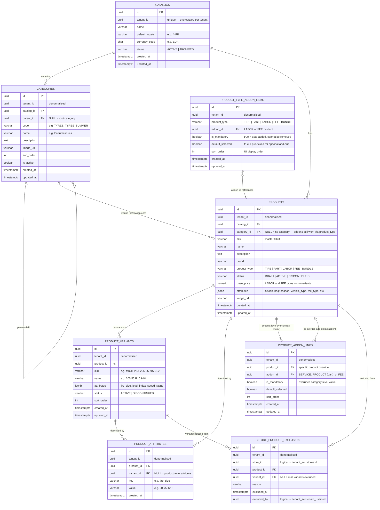

# Catalog Domain — ER Diagram

## Design Rules

| Rule | Implementation |
|---|---|
| One catalog per tenant | `catalogs.tenant_id` unique |
| Categories form a tree | `categories.parent_id` self-reference — unlimited depth |
| Every item in the catalog is an article with a SKU | `products.sku` NOT NULL — TIRE, PART, LABOR, FEE, and BUNDLE are all articles |
| `product_type` drives behaviour, not article status | Type controls: variants, pricing location, invoice rendering — not whether something is a real article |
| Sellable tire/part items are variants | `product_variants` — one row per size/colour/spec combination |
| Single-SKU product still has one variant | Keeps pricing and inventory anchored to `variant_id` consistently |
| LABOR and FEE articles have no variants | Price on `products.base_price` — the SKU itself is the sellable unit |
| Product-type add-ons apply to all products sharing the same type | `product_type_addon_links` — define once for `TIRE`, inherited by every tyre regardless of category |
| Product-level add-ons override type defaults | `product_addon_links` — used only for exceptions, most products have no rows here |
| FEE = regulatory charge only | Must appear as separate invoice line by law — recycling tax, env fee |
| Default = every product available at every store | No row in `store_product_exclusions` means available |
| Exception-based assortment | `store_product_exclusions` — only the 5% exceptions are stored |
| Exclusion can be product-wide or variant-level | `variant_id NULL` = whole product excluded; set = specific variant only |
| Flexible attributes via jsonb + normalised rows | `products.attributes` for the bag; `product_attributes` for searchable key/value |

---

## Product Types Explained

Every row in the `products` table is an **article** — it has its own `sku`, `name`, and `brand` regardless of type. `product_type` controls system behaviour only: whether variants exist, where the price lives, and how the article appears on the invoice.

### TIRE
A physical tyre article (e.g. SKU `BRID-T005`, Bridgestone Turanza T005).
- Has one or more **variants** (e.g. 205/55R16, 225/45R17) — the variant is the sellable SKU
- Price is set at the variant level in `pricing_svc`
- **Single-size tyre:** still creates one variant row — keeps pricing/inventory logic uniform
- Automatically inherits add-ons (installation, fees, warranty) via `product_type_addon_links`

### PART
A physical accessory or replacement part article (e.g. SKU `PART-TPMS-VALVE`, TPMS Valve Kit).
- Has variants when multiple sizes/specs exist; single-spec parts have one variant row
- Price at the variant level in `pricing_svc`
- Can be linked as a mandatory or optional add-on to a TIRE via `product_addon_links`

### LABOR
A labour or service article — has its own SKU and is invoiced as a line item (e.g. SKU `SVC-TYRE-INSTALL`, Tyre Installation Package).
- **No variants** — the SKU itself is the sellable unit
- Price on `products.base_price`
- Linked as a mandatory or optional add-on via `product_type_addon_links`

### FEE
A regulatory charge article — has its own SKU and must appear as a **separate line on the invoice** by law (e.g. SKU `FEE-TYRE-RECYCLING`, Tyre Recycling Fee).
- **No variants** — the SKU itself is the sellable unit
- Price on `products.base_price`
- `attributes.fee_type` = `'regulatory'` — drives invoice rendering and tax treatment
- Customer cannot remove a mandatory FEE from the cart

### BUNDLE
A fixed pre-packaged article sold as a single unit with one SKU and one bundle price.
- Components are defined in `bundle_items` (future table — not yet implemented)
- Example: SKU `BUN-WINTER-PACK` = 4 winter tyres + fitting + storage at one fixed price

> **Bundle vs Add-on Links:**
> If each component has a separate invoice line → use `product_addon_links`.
> If the whole pack is one invoice line at one price → use `BUNDLE`.

---

## Real-World Example — Tyre Package

**What the customer sees (invoice):**

```
Bridgestone Turanza T005 205/55R16 91V  × 4   €823.96   ← TIRE + variant, price from pricing_svc
Tyre Installation Package              × 4   €180.00   ← LABOR  SVC-TYRE-INSTALL €45.00 each
Tyre Recycling Fee            × 4   € 17.00   ← FEE      regulatory, separate line by law
State Environmental Fee       × 4   €  4.00   ← FEE      regulatory, separate line by law
──────────────────────────────────────────────
Subtotal                           €1,024.96
Taxes                              €   56.95
Out the door                       €1,081.91

Optional: Tyre Protection Warranty × 4  €39.96  ← SERVICE opt-in upsell
```

**How add-ons are linked (product_type_addon_links on type TIRE):**

```
product_type = TIRE
  └── SVC-TYRE-INSTALL    is_mandatory=true   sort=1  (every tyre sold includes install)
  └── FEE-TYRE-RECYCLING  is_mandatory=true   sort=2  (law requires separate line)
  └── FEE-ENV-STATE       is_mandatory=true   sort=3  (law requires separate line)
  └── SVC-WARRANTY-TYRE   is_mandatory=false  sort=4  (optional upsell)
```

Applies automatically to Bridgestone Turanza T005, Michelin Pilot Sport 4, Toyo PROXES — every tyre, regardless of category.

---

## Tire Package — Table Diagram

This diagram shows only the tables involved when a tire is sold as a package. `TIRE_PRODUCT` and `ADDON_PRODUCT` both map to the same `products` table — every article (TIRE, LABOR, FEE) has its own SKU, name, and brand. They are separated here only to show their distinct roles in the package.



**How the package assembles at checkout:**

| Step | Source | Example |
|---|---|---|
| 1 | Customer selects a tire variant | Bridgestone T005 205/55 R16 91V |
| 2 | Load `product_type_addon_links` where `product_type = 'TIRE'` | Installation + Recycling Fee + Env Fee + Warranty |
| 3 | Merge `product_addon_links` for this specific tire (if any rows exist) | e.g. run-flat skips installation |
| 4 | Apply `store_product_exclusions` for the selected store | Lyon store: installation excluded |
| 5 | Result = final add-on set rendered to cart | Mandatory ones auto-added; optional ones shown as upsell |

---

## Add-on Inheritance — Product Type → Product

Add-ons are defined at the **product type level** and inherited by every product sharing that type. Category membership is irrelevant — a tyre added directly to the catalog without any category still inherits its add-ons.

```
product_type = TIRE  ← product_type_addon_links defined here once
  ├── Bridgestone Turanza T005 → inherits all add-ons automatically
  ├── Michelin Pilot Sport 4  → inherits all add-ons automatically
  ├── Toyo PROXES             → inherits all add-ons automatically
  └── Run-flat XYZ            → inherits type defaults + product_addon_links override (e.g. no installation)
```

**Checkout resolution order:**
1. Load `product_type_addon_links` for the product's `product_type`
2. Merge `product_addon_links` for the specific product
3. Product-level entry wins when the same `addon_id` appears in both

**Add-on behaviour:**

| `is_mandatory` | `default_selected` | Behaviour |
|---|---|---|
| `true` | — | Auto-added to cart, customer cannot remove |
| `false` | `true` | Pre-ticked in UI, customer can opt out |
| `false` | `false` | Shown as upsell, customer must opt in |

---

## ER Diagram



---

## Key Design Decisions

### Single-SKU products still have one variant
Pricing and inventory always anchor to `variant_id`, never `product_id`. This means the checkout and pricing services have one consistent code path regardless of how many variants a product has. A "single-SKU" product is just a product with one variant row.

### Exception-based assortment
Most assortment models use an opt-in table (a row per store-product pair = millions of rows). For Speedy France where 95% of products are available everywhere, we invert:

> **No row = available. A row = excluded.**

Query to check if a product is available at a store:
```sql
SELECT COUNT(*) = 0 AS is_available
FROM catalog_svc.store_product_exclusions
WHERE store_id   = $1
  AND product_id = $2
  AND (variant_id IS NULL OR variant_id = $3);
```

### `attributes` jsonb + `product_attributes` rows
Two complementary approaches:
- `products.attributes` jsonb — fast reads, no schema change for new attributes
- `product_attributes` rows — normalised, indexed on `(key, value)` for filtered search (e.g. "find all 205/55R16 tyres")

### Category tree depth
`parent_id` self-reference supports unlimited nesting. Application layer uses a recursive CTE to fetch subtrees:
```sql
WITH RECURSIVE tree AS (
  SELECT * FROM catalog_svc.categories WHERE parent_id IS NULL AND catalog_id = $1
  UNION ALL
  SELECT c.* FROM catalog_svc.categories c JOIN tree t ON c.parent_id = t.id
)
SELECT * FROM tree;
```

---

## Cross-Domain References (logical — no FK constraints across services)

| Column | Points To | Owned By |
|---|---|---|
| `catalogs.tenant_id` | `tenant_svc.tenants.id` | Tenant service |
| `store_product_exclusions.store_id` | `tenant_svc.stores.id` | Tenant service |
| `store_product_exclusions.excluded_by` | `tenant_svc.tenant_users.id` | Tenant service |

---

## Catalog Service API Surface (planned)

| Operation | Notes |
|---|---|
| `GET /catalogs/{tenantId}/products` | List all active products |
| `GET /catalogs/{tenantId}/products?storeId=` | Apply store exclusions filter |
| `GET /catalogs/{tenantId}/categories` | Full category tree |
| `GET /products/{id}/variants` | All variants for a product |
| `GET /products/{id}/addons` | All add-ons linked to a product (services, parts, fees) — mandatory and optional |
| `POST /catalogs/{tenantId}/exclusions` | Exclude a product from a store |
| `DELETE /catalogs/{tenantId}/exclusions/{id}` | Re-include a previously excluded product |
