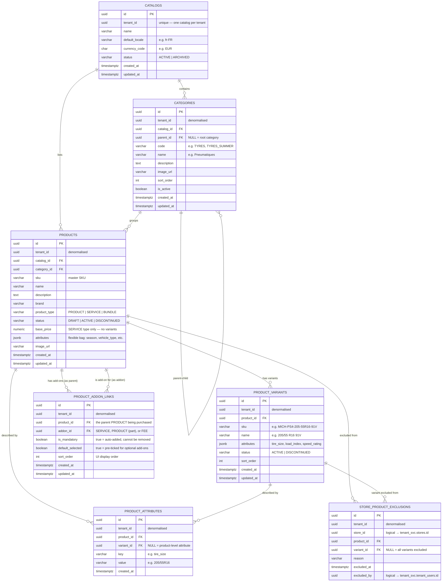

# Catalog Domain — ER Diagram

## Design Rules

| Rule | Implementation |
|---|---|
| One catalog per tenant | `catalogs.tenant_id` unique |
| Categories form a tree | `categories.parent_id` self-reference — unlimited depth |
| Products have a type | `product_type` IN (`PRODUCT`, `SERVICE`, `BUNDLE`, `FEE`) |
| Sellable items are variants | `product_variants` — one row per size/colour/spec combination |
| Single-SKU product still has one variant | Keeps pricing and inventory anchored to `variant_id` consistently |
| SERVICE and FEE have no variants | Price on `products.base_price` — nothing to vary |
| Products can have mandatory and optional add-ons | `product_addon_links` — add-on can be SERVICE, PRODUCT (part), or FEE |
| FEE is a regulatory or operational charge | `fee_type` attribute: `regulatory` (recycling, env) or `operational` (shop supplies) |
| Default = every product available at every store | No row in `store_product_exclusions` means available |
| Exception-based assortment | `store_product_exclusions` — only the 5% exceptions are stored |
| Exclusion can be product-wide or variant-level | `variant_id NULL` = whole product excluded; set = specific variant only |
| Flexible attributes via jsonb + normalised rows | `products.attributes` for the bag; `product_attributes` for searchable key/value |

---

## Product Types Explained

### PRODUCT
A physical item sold by SKU (e.g. Michelin Pilot Sport 4, TPMS Valve Kit).
- Has one or more **variants** (e.g. 205/55R16, 225/45R17)
- Price is set at the variant level in `pricing_svc`
- **Single-SKU product:** still creates one variant row — keeps pricing/inventory logic uniform
- Can be an add-on to another product (e.g. TPMS Valve Kit is a physical part mandatory with every tyre)

### SERVICE
A labour or service item — no physical inventory (e.g. tyre fitting, wheel balance, warranty).
- **No variants** — nothing to vary
- Price sits on `products.base_price` or can be overridden in `pricing_svc`
- Can be standalone or linked as a mandatory/optional add-on to a PRODUCT

### FEE
A regulatory or operational charge automatically applied — not a product, not labour.
- **No variants, no inventory**
- Price on `products.base_price`
- Examples: Scrap Tyre Recycling Charge, State Environmental Fee, Shop Supplies
- `attributes.fee_type` = `'regulatory'` or `'operational'` — useful for invoice rendering and tax treatment

### BUNDLE
A **fixed pre-packaged** offering sold as a single unit with one SKU and one bundle price.
- Components are defined in `bundle_items` (future table — not yet implemented)
- Example: "Pack Hiver" = 4 winter tyres + fitting + storage at one fixed price

> **Bundle vs Add-on Links:**
> If each component has a separate line on the invoice → use `product_addon_links`.
> If the whole pack is one line item at one price → use `BUNDLE`.

---

## Real-World Example — Tyre Package (Firestone model)

Based on a real tyre product page, here is how the full package maps to the data model:

```
Toyo PROXES ST III 235/60R18 XL    → products (PRODUCT) + product_variants (235/60R18)
                                      qty=4, $205.99 each
                                      Price via pricing_svc

Installation Fees breakdown:
  Computerized Wheel Balance        → products (SERVICE)  SVC-WHEEL-BALANCE   $13.99  mandatory
  TPMS Valve Service Kit            → products (PRODUCT)  PART-TPMS-VALVE-KIT  $7.99  mandatory
  TPMS Valve Service Kit Labor      → products (SERVICE)  SVC-TPMS-LABOUR      $3.31  mandatory
  Scrap Tire Recycling Charge       → products (FEE)      FEE-TYRE-RECYCLING   $4.25  mandatory, fee_type=regulatory
  State Environmental Fee           → products (FEE)      FEE-ENV-STATE        $1.00  mandatory, fee_type=regulatory
  Shop Supplies                     → products (FEE)      FEE-SHOP-SUPPLIES    $1.73  mandatory, fee_type=operational

Optional upsell:
  Protection Warranty (1 year)      → products (SERVICE)  SVC-WARRANTY-TYRE    $9.99  optional, not pre-ticked
```

All linked via `product_addon_links` where `product_id` = the tyre and `addon_id` = each item above.

**Cart total for 4 tyres:**
```
Tyres:    4 × $205.99 = $823.96
Add-ons:  4 × ($13.99 + $7.99 + $3.31 + $4.25 + $1.00 + $1.73) = $129.08
Taxes:    $56.95
──────────────────────────────
Out the door: $1,009.99
```

---

## Product-Service Association (mandatory + optional services)

When a PRODUCT requires or offers related SERVICEs, `product_service_links` defines the relationship.

| `is_mandatory` | `default_selected` | Behaviour |
|---|---|---|
| `true` | `false` | Auto-added to cart, customer cannot remove it |
| `false` | `true` | Pre-ticked in UI, customer can opt out |
| `false` | `false` | Shown as an upsell, customer must opt in |

**Speedy France example — buying a tyre:**
```
Michelin PS4 (PRODUCT)
  ├── Tyre Fitting — SVC-FITTING         is_mandatory=true   (auto-added, no choice)
  └── Protection Warranty — SVC-WARRANTY is_mandatory=false  (upsell, opt-in)
```

Cart total = tyre price + fitting price + (warranty price if selected)

---

## ER Diagram



---

## Key Design Decisions

### Single-SKU products still have one variant
Pricing and inventory always anchor to `variant_id`, never `product_id`. This means the checkout and pricing services have one consistent code path regardless of how many variants a product has. A "single-SKU" product is just a product with one variant row.

### Exception-based assortment
Most assortment models use an opt-in table (a row per store-product pair = millions of rows). For Speedy France where 95% of products are available everywhere, we invert:

> **No row = available. A row = excluded.**

Query to check if a product is available at a store:
```sql
SELECT COUNT(*) = 0 AS is_available
FROM catalog_svc.store_product_exclusions
WHERE store_id   = $1
  AND product_id = $2
  AND (variant_id IS NULL OR variant_id = $3);
```

### `attributes` jsonb + `product_attributes` rows
Two complementary approaches:
- `products.attributes` jsonb — fast reads, no schema change for new attributes
- `product_attributes` rows — normalised, indexed on `(key, value)` for filtered search (e.g. "find all 205/55R16 tyres")

### Category tree depth
`parent_id` self-reference supports unlimited nesting. Application layer uses a recursive CTE to fetch subtrees:
```sql
WITH RECURSIVE tree AS (
  SELECT * FROM catalog_svc.categories WHERE parent_id IS NULL AND catalog_id = $1
  UNION ALL
  SELECT c.* FROM catalog_svc.categories c JOIN tree t ON c.parent_id = t.id
)
SELECT * FROM tree;
```

---

## Cross-Domain References (logical — no FK constraints across services)

| Column | Points To | Owned By |
|---|---|---|
| `catalogs.tenant_id` | `tenant_svc.tenants.id` | Tenant service |
| `store_product_exclusions.store_id` | `tenant_svc.stores.id` | Tenant service |
| `store_product_exclusions.excluded_by` | `tenant_svc.tenant_users.id` | Tenant service |

---

## Catalog Service API Surface (planned)

| Operation | Notes |
|---|---|
| `GET /catalogs/{tenantId}/products` | List all active products |
| `GET /catalogs/{tenantId}/products?storeId=` | Apply store exclusions filter |
| `GET /catalogs/{tenantId}/categories` | Full category tree |
| `GET /products/{id}/variants` | All variants for a product |
| `GET /products/{id}/addons` | All add-ons linked to a product (services, parts, fees) — mandatory and optional |
| `POST /catalogs/{tenantId}/exclusions` | Exclude a product from a store |
| `DELETE /catalogs/{tenantId}/exclusions/{id}` | Re-include a previously excluded product |
