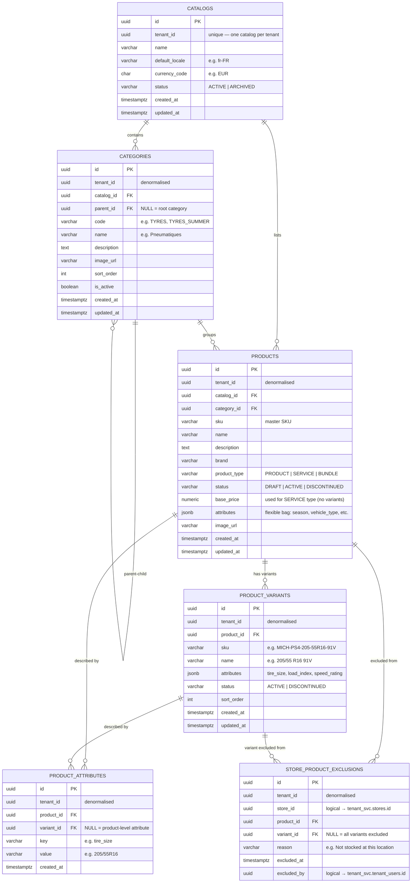

# Catalog Domain — ER Diagram

## Design Rules

| Rule | Implementation |
|---|---|
| One catalog per tenant | `catalogs.tenant_id` unique |
| Categories form a tree | `categories.parent_id` self-reference — unlimited depth |
| Products have a type | `product_type` IN (`PRODUCT`, `SERVICE`, `BUNDLE`) |
| Sellable items are variants | `product_variants` — one row per size/colour/spec combination |
| Services have no variants | `product_type = 'SERVICE'` → price sits on `products.base_price` |
| Default = every product available at every store | No row in `store_product_exclusions` means available |
| Exception-based assortment | `store_product_exclusions` — only the 5% exceptions are stored |
| Exclusion can be product-wide or variant-level | `variant_id NULL` = whole product excluded; set = specific variant only |
| Flexible attributes via jsonb + normalised rows | `products.attributes` for the bag; `product_attributes` for searchable key/value |

---

## ER Diagram



---

## Key Design Decisions

### Exception-based assortment
Most assortment models use an opt-in table (a row per store-product pair = millions of rows). For Speedy France where 95% of products are available everywhere, we invert this:

> **No row = available. A row = excluded.**

Query to check if a product is available at a store:
```sql
SELECT COUNT(*) = 0 AS is_available
FROM catalog_svc.store_product_exclusions
WHERE store_id  = $1
  AND product_id = $2
  AND (variant_id IS NULL OR variant_id = $3);
```

Query to get all available products at a store:
```sql
SELECT p.*
FROM catalog_svc.products p
WHERE p.catalog_id = $1
  AND p.status = 'ACTIVE'
  AND p.id NOT IN (
    SELECT product_id FROM catalog_svc.store_product_exclusions
    WHERE store_id = $2 AND variant_id IS NULL
  );
```

### `PRODUCT` vs `SERVICE` type
- `PRODUCT` — has variants (e.g. a tyre in different sizes); price is on the variant via pricing_svc
- `SERVICE` — no variants (e.g. tyre fitting); `base_price` sits directly on the product row
- `BUNDLE` — reserved for future grouped offerings (e.g. tyre + fitting package)

### Category tree depth
`parent_id` self-reference supports unlimited nesting:
```
TYRES (root)
 └── TYRES_SUMMER
 └── TYRES_WINTER
 └── TYRES_ALLSEASON
SERVICES (root)
PARTS (root)
```
Application layer uses recursive CTE to fetch full subtree when needed.

### `attributes` jsonb + `product_attributes` rows
Two complementary approaches:
- `products.attributes` jsonb — fast reads, no schema change needed for new attributes
- `product_attributes` rows — normalised, indexable on `(key, value)` for filtered search (e.g. "find all 205/55R16 tyres")

---

## Cross-Domain References (logical — no FK constraints across services)

| Column | Points To | Owned By |
|---|---|---|
| `catalogs.tenant_id` | `tenant_svc.tenants.id` | Tenant service |
| `store_product_exclusions.store_id` | `tenant_svc.stores.id` | Tenant service |
| `store_product_exclusions.excluded_by` | `tenant_svc.tenant_users.id` | Tenant service |

---

## Catalog Service API Surface (planned)

| Operation | Notes |
|---|---|
| `GET /catalogs/{tenantId}/products` | List all active products for a tenant |
| `GET /catalogs/{tenantId}/products?storeId=` | List products available at a specific store (applies exclusions) |
| `GET /catalogs/{tenantId}/categories` | Full category tree |
| `GET /products/{id}/variants` | All variants for a product |
| `POST /catalogs/{tenantId}/exclusions` | Exclude a product from a store |
| `DELETE /catalogs/{tenantId}/exclusions/{id}` | Re-include a previously excluded product |
