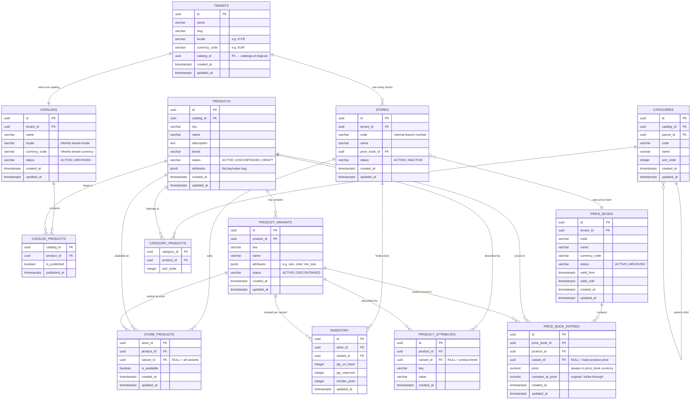

# Catalog & Pricing Domain — ER Diagram

## Design Rules

| Rule | Implementation |
|---|---|
| One tenant → one catalog | `catalogs.tenant_id` unique |
| One tenant → one language | `tenants.locale` in tenant-domain; catalog inherits it |
| Catalog contains all products | `catalog_products` links `catalog_id → product_id` |
| Not every store sells every product | `store_products` opt-in assortment per store |
| One price book per store | `stores.price_book_id` (NOT NULL) |
| Multiple stores may share a price book | `price_book_id` is a FK to `price_books.id` — many stores → one book |
| Price is on the price book entry | `price_book_entries (price_book_id, product_id)` |

---

## ER Diagram

---

## Key Design Decisions

### Catalog is tenant-scoped, not store-scoped
All stores of a tenant share one product master. This means a product is defined once and listed in `catalog_products`. Whether a specific store *sells* it is controlled by `store_products` (opt-in assortment).

### Store assortment (`store_products`)
- Row present + `is_available = true` → store sells this product/variant
- Row absent → store does NOT sell it
- `variant_id IS NULL` → the row applies to all variants of the product
- `variant_id IS NOT NULL` → variant-level override (e.g. store sells 205/55R16 but not 225/45R17)

### Price books
- A `price_book` belongs to a tenant and has a currency
- A `store` has exactly one `price_book_id` (NOT NULL)
- Many stores can share the same price book (e.g. all Paris stores use `PB-IDF`)
- `price_book_entries` holds the actual price per product/variant
- `compare_at_price` stores the original price for strike-through display

### Variants
- `products` = the master product (e.g. "Michelin Pilot Sport 4")
- `product_variants` = the sellable SKU (e.g. "205/55 R16 91V")
- Price book entries and inventory are tracked at the **variant** level

### Locale / Language
- One locale per tenant (e.g. `fr-FR`) — stored on `tenants.locale`
- `catalogs.locale` mirrors it for the catalog service boundary
- No translation tables in v1 — product names are in the tenant's language

---

## Cross-Domain References (logical — no FK constraints across services)

| Column | Points To | Owned By |
|---|---|---|
| `tenants.catalog_id` | `catalogs.id` | Catalog service |
| `stores.price_book_id` | `price_books.id` | Pricing service |
| `stores.tenant_id` | `tenants.id` | Tenant service |
| `catalogs.tenant_id` | `tenants.id` | Tenant service |
| `price_books.tenant_id` | `tenants.id` | Tenant service |

---

## Microservice Boundaries

| Service | Tables | Domain Doc |
|---|---|---|
| **Tenant service** | `tenants`, `stores` | _(this doc)_ |
| **Catalog service** | `catalogs`, `categories`, `products`, `product_variants`, `product_attributes`, `catalog_products`, `category_products` | _(this doc)_ |
| **Pricing service** | `price_books`, `price_book_entries` | _(this doc)_ |
| **Assortment service** | `store_products` | _(this doc)_ |
| **Inventory service** | `inventory` | _(this doc)_ |
| **Customer service** | `customers` | [customer-domain.md](customer-domain.md) |
| **Order service** | `orders`, `order_items`, `order_promotions` | [order-domain.md](order-domain.md) |
| **Promotion service** | `promotions`, `config_entries`, `promotion_redemptions` | [promotion-domain.md](promotion-domain.md) |

Each service owns its schema. Foreign keys between service boundaries are **logical only** (no DB-level constraint).
