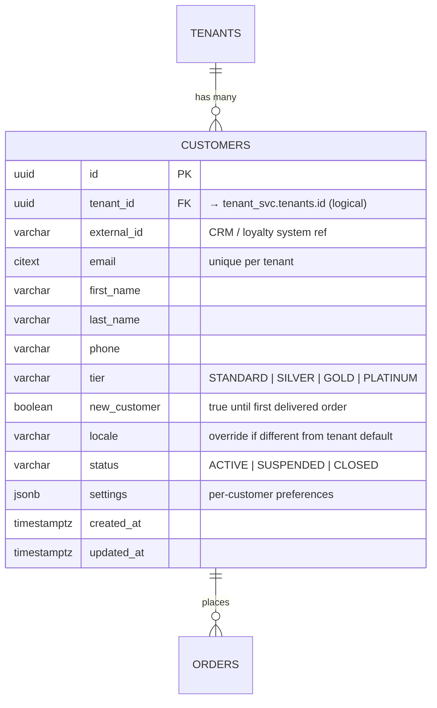

# Customer Domain — ER Diagram

## Design Rules

| Rule | Implementation |
|---|---|
| One customer per tenant per email | `customers (tenant_id, email)` unique |
| Loyalty tier drives promotion eligibility | `tier` IN (`STANDARD`,`SILVER`,`GOLD`,`PLATINUM`) — maps to `Customer.CustomerTier` in promotion engine |
| New-customer flag | `new_customer = true` until first completed order; cleared by order service on `DELIVERED` |
| Tenant-scoped | A customer in Speedy France cannot access another tenant's data |
| Guest checkout supported | `order_svc.orders.customer_id` is nullable — no customer row needed |

---

## ER Diagram

---

## Key Design Decisions

### Tier maps directly to `Customer.CustomerTier` enum
The promotion engine's `Customer.java` uses `CustomerTier { STANDARD, SILVER, GOLD, PLATINUM }`. The DB `tier` column uses the same values, so no translation is needed when hydrating a `Customer` object for Drools evaluation.

### `new_customer` lifecycle
- Created `true` when customer registers
- Set to `false` by the order service when the customer's first order reaches `DELIVERED` status
- Promotions like `WELCOME10` / `SPEEDY_WELCOME15` check `customer.newCustomer == true` in Drools — this flag is the source of truth

### Tenant isolation
`customers` is tenant-scoped. The unique constraint is on `(tenant_id, email)`, not just `email`, to support the same person registering as a customer at multiple franchise tenants.

### Guest checkout
`customer_id` is nullable in `order_svc.orders`. Guest orders still capture `cart.customer` (name, tier, newCustomer) as a snapshot at order time — the customer object is embedded in the order, not required to exist in `customer_svc`.

---

## Microservice Boundary

| Service | Tables |
|---|---|
| **Customer service** | `customers` |

Cross-service references (logical — no DB-level FK constraints):

| Column | Points To | Owned By |
|---|---|---|
| `customers.tenant_id` | `tenant_svc.tenants.id` | Tenant service |
| `order_svc.orders.customer_id` | `customer_svc.customers.id` | Customer service |
| `promotion_svc.promotion_redemptions.customer_id` | `customer_svc.customers.id` | Customer service |
