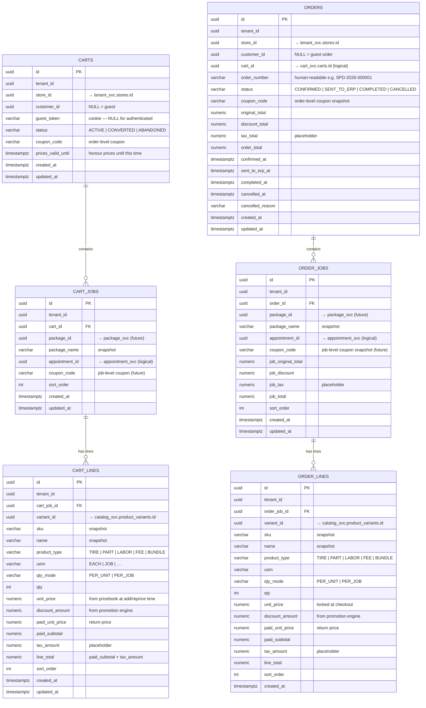

# Order Domain — ER Diagram

## Design Rules

| Rule | Implementation |
|---|---|
| Cart and order are separate services | `cart_svc` = transient; `order_svc` = permanent business record |
| Cart survives until converted or purged | `carts.status` ACTIVE → CONVERTED / ABANDONED — never hard-deleted |
| Abandoned carts retained for marketing | Soft status only — cron marks ABANDONED, never deletes |
| Guest cart identified by cookie | `carts.guest_token` NOT NULL when `customer_id` IS NULL |
| Login creates a new cart | Guest cart is abandoned on login — no merge |
| Price repriced on session expiry | `carts.prices_valid_until` — honour live prices during active session; reprice after expiry |
| Price locked at checkout | `order_lines.unit_price` is a snapshot — pricebook changes do not affect existing orders |
| Three-layer structure | `cart/order → jobs → lines` |
| Job is anchored to a package | `cart_jobs.package_id` → package_svc (future); `package_name` snapshotted |
| One appointment per job | `cart_jobs.appointment_id` → appointment_svc (logical); two jobs may share the same ID |
| Addons are explicit lines | Resolved from `product_type_addon_links` at add-time; stored as sibling lines under the job |
| Promotions applied per line | Engine returns `discount_amount` and `paid_unit_price` per line; order/job totals are aggregates |
| Order-level promotion applied after job promotions | Engine fires line → job → order; final price per line is the output |
| Job-level coupon column present | `coupon_code` on `cart_jobs` / `order_jobs` — engine support is future |
| Tax is a placeholder | `tax_amount` column on every line — tax design deferred |
| No shipping | Not applicable |
| Cancellation is all-or-nothing | `CANCELLED` at order level — no job-level cancellation |
| ERP receives full order | `SENT_TO_ERP` status; order payload includes all jobs and lines |

---

## Cart vs Order

| | Cart (`cart_svc`) | Order (`order_svc`) |
|---|---|---|
| Lifecycle | Transient — days/weeks | Permanent — years |
| Mutability | Fully mutable | Immutable once CONFIRMED |
| Price | Live from pricebook (repriced on session expiry) | Locked at checkout |
| Commitment | None | Financial — payment linked |
| Guest support | Yes — `guest_token` | Yes — `customer_id` nullable |
| Retention | Until cron purge | Forever |

---

## Real-World Example — Tyre Installation Order

**Cart → Order conversion (one job, one tyre):**

```
Order SPD-2026-000001   status=CONFIRMED   store=Paris 1st

  Job 1: Tyre Installation   appointment=APT-001
  ┌─────────────────────────────────────────────────────────────────────┐
  │ SKU                     Type   Qty  Unit    Disc   Paid    Total   │
  │ BRID-T005-205-55R16-91V TIRE     1  205.99  0.00  205.99  205.99  │
  │ SVC-TYRE-INSTALL-STD    LABOR    1   45.00  0.00   45.00   45.00  │
  │ FEE-TYRE-RECYCLING-STD  FEE      1    4.25  0.00    4.25    4.25  │
  │ FEE-ENV-STATE-STD       FEE      1    1.00  0.00    1.00    1.00  │
  │ SVC-WARRANTY-TYRE-1YR   LABOR    1    9.99  0.00    9.99    9.99  │
  └─────────────────────────────────────────────────────────────────────┘
  Job total:   266.23
  ─────────────────────────────────────────────────────────────────────
  Order total: 266.23  (discount=0.00  tax=0.00 — placeholder)
```

---

## Promotion Engine Contract

The cart service calls the promotion engine once at checkout with the full job hierarchy.
The engine returns a final `paid_unit_price` per line after applying all three promotion levels.

**Input:**
```
Cart {
  cartId, customerId, tenantId, storeId, couponCode
  jobs: [
    Job { jobId, packageId, couponCode (future),
      items: [ CartItem { productId, category, qty, unitPrice } … ]
    }
  ]
}
```

**Output — per line:**
```
LineItemResult {
  productId, qty,
  originalUnitPrice,   ← from pricebook
  discountAllocated,   ← sum of line + job share + order share
  paidSubtotal,        ← what the customer pays
  paidUnitPrice        ← return price — used if item is returned later
}
```

**Resolution order inside engine:**
1. Line-level promotions (specific SKU or category)
2. Job-level promotions (all lines in the job — job discount spread proportionally)
3. Order-level promotions (entire cart — order discount spread proportionally across all lines)

---

## Order Status Flow

```
CONFIRMED ──→ SENT_TO_ERP ──→ COMPLETED
     │
     └──→ CANCELLED  (any time before COMPLETED)
```

| Status | Meaning |
|---|---|
| `CONFIRMED` | Checkout complete, payment captured, order locked |
| `SENT_TO_ERP` | Full order payload dispatched to ERP — ERP owns fulfilment from here |
| `COMPLETED` | ERP confirms job done — vehicle ready for customer |
| `CANCELLED` | Whole order cancelled — all jobs cancelled together |

---

## ER Diagram



---

## Key Design Decisions

### Cart and order are separate services
Cart is optimised for reads, mutations, and session management. Order is optimised for immutability, audit, and ERP integration. They have different retention policies (cart is purgeable; orders are permanent) and different consistency requirements.

### Three-layer structure: order → job → line
A job is the unit of work — it maps to one appointment, one package, and one set of articles. This lets the ERP understand what work to perform in one visit vs separate visits. Two jobs sharing the same `appointment_id` means one visit, two distinct service jobs.

### Addons are explicit lines, not metadata
When the cart service adds a job, it immediately resolves `product_type_addon_links` and inserts the addon lines under the same job. The order domain does not know or care about addon rules — by the time an order is created every line is an explicit article with its own SKU, price, and qty.

### Prices repriced on session expiry, locked at checkout
While the cart session is active (`now() < prices_valid_until`), the prices in `cart_lines` are honoured even if the pricebook changes. When the session expires the pricing service reprices all lines before the customer can check out. At checkout prices are locked into `order_lines` permanently.

### `paid_unit_price` is the return price
If a customer returns an article after a promotion was applied, the refund must reflect what they actually paid — not the catalogue price. `paid_unit_price` from the promotion engine is the authoritative value for returns and partial refunds.

### Job-level coupon column present but engine support is future
`coupon_code` exists on `cart_jobs` and `order_jobs` today. The promotion engine currently only processes order-level coupons. When the engine is updated to handle job-level coupons, no schema change is needed.

---

## Cross-Domain References (logical — no FK constraints across services)

| Column | Points To | Owned By |
|---|---|---|
| `carts.tenant_id` | `tenant_svc.tenants.id` | Tenant service |
| `carts.store_id` | `tenant_svc.stores.id` | Tenant service |
| `carts.customer_id` | `customer_svc.customers.id` | Customer service |
| `cart_jobs.package_id` | `package_svc.packages.id` | Package service (future) |
| `cart_jobs.appointment_id` | `appointment_svc.appointments.id` | Appointment service |
| `cart_lines.variant_id` | `catalog_svc.product_variants.id` | Catalog service |
| `orders.store_id` | `tenant_svc.stores.id` | Tenant service |
| `orders.customer_id` | `customer_svc.customers.id` | Customer service |
| `orders.cart_id` | `cart_svc.carts.id` | Cart service |
| `order_jobs.appointment_id` | `appointment_svc.appointments.id` | Appointment service |
| `order_lines.variant_id` | `catalog_svc.product_variants.id` | Catalog service |

---

## Cart Service API Surface (planned)

| Operation | Notes |
|---|---|
| `POST /carts` | Create cart (guest or authenticated) |
| `POST /carts/{id}/jobs` | Add a job (resolves addons automatically from package) |
| `DELETE /carts/{id}/jobs/{jobId}` | Remove a job and all its lines |
| `PUT /carts/{id}/jobs/{jobId}/lines/{lineId}` | Update qty on a line |
| `POST /carts/{id}/reprice` | Reprice all lines from current pricebook (called on session expiry) |
| `POST /carts/{id}/checkout` | Convert cart to order — calls promotion engine, locks prices |

## Order Service API Surface (planned)

| Operation | Notes |
|---|---|
| `GET /orders/{id}` | Fetch full order with jobs and lines |
| `GET /orders?customerId=&status=` | List orders for a customer |
| `POST /orders/{id}/send-to-erp` | Dispatch full order payload to ERP |
| `POST /orders/{id}/cancel` | Cancel entire order |
| `POST /orders/{id}/complete` | Mark order completed (called by ERP webhook) |
