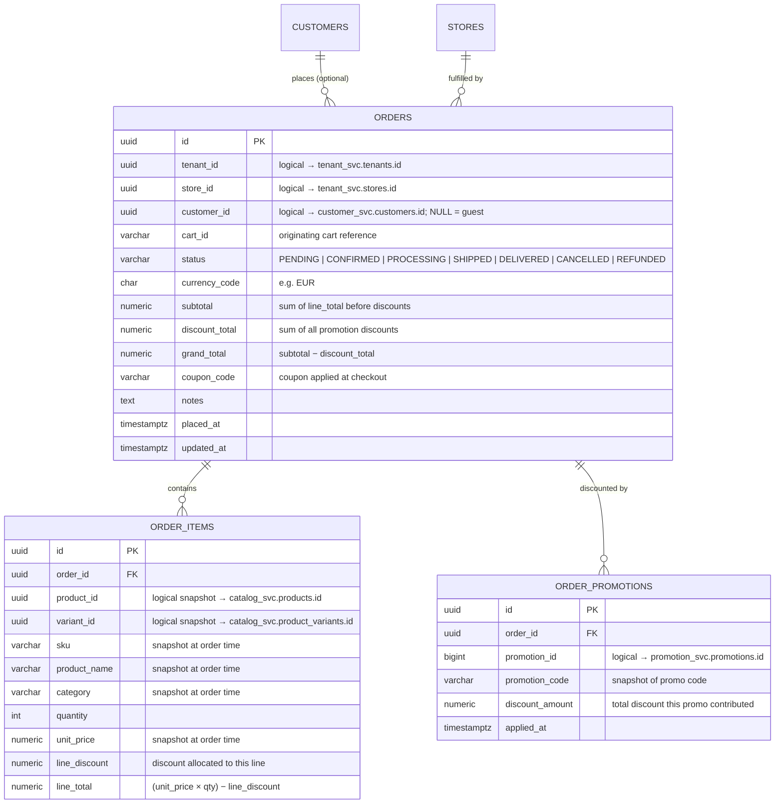

# Order Domain — ER Diagram

## Design Rules

| Rule | Implementation |
|---|---|
| One order per cart submission | `orders.cart_id` records the originating cart reference |
| Order is always scoped to a tenant + store | `orders.tenant_id` + `orders.store_id` (NOT NULL) |
| Guest checkout allowed | `orders.customer_id` nullable |
| Line items capture a snapshot at order time | `order_items` stores `sku`, `product_name`, `category`, `unit_price` — not live catalog refs |
| Promotion discounts are tracked per order | `order_promotions` one row per applied promotion |
| `grand_total = subtotal − discount_total` | Enforced by application; DB stores all three for audit |

---

## ER Diagram



---

## Key Design Decisions

### Snapshot pattern for line items
`order_items` copies `sku`, `product_name`, `category`, and `unit_price` at the moment the order is placed. This means catalog changes (price updates, product renames, discontinuation) do not retroactively alter historical orders. The `product_id` / `variant_id` columns are retained as logical references for reporting but carry no FK constraint.

### `order_promotions` decouples discount capture from Drools
When the promotion engine fires and returns `appliedPromotions`, each result is persisted as an `order_promotions` row. This allows:
- Reporting: revenue impact per promotion
- Reconciliation: `sum(order_promotions.discount_amount)` must equal `orders.discount_total`
- Audit: which promotions were active at time of order (even if later disabled)

### Status lifecycle
```
PENDING → CONFIRMED → PROCESSING → SHIPPED → DELIVERED
       ↘ CANCELLED
DELIVERED / SHIPPED → REFUNDED
```
The order service fires a domain event on `DELIVERED` that triggers `customer_svc` to clear `customers.new_customer = false`.

### `cart_id` linkage
The cart is ephemeral (lives in the promotion engine's request model — no DB). `orders.cart_id` stores the `CART-{timestamp}` value so the checkout flow can correlate the Drools response with the persisted order.

---

## Microservice Boundary

| Service | Tables |
|---|---|
| **Order service** | `orders`, `order_items`, `order_promotions` |

Cross-service references (logical — no DB-level FK constraints):

| Column | Points To | Owned By |
|---|---|---|
| `orders.tenant_id` | `tenant_svc.tenants.id` | Tenant service |
| `orders.store_id` | `tenant_svc.stores.id` | Tenant service |
| `orders.customer_id` | `customer_svc.customers.id` | Customer service |
| `order_items.product_id` | `catalog_svc.products.id` | Catalog service |
| `order_items.variant_id` | `catalog_svc.product_variants.id` | Catalog service |
| `order_promotions.promotion_id` | `promotion_svc.promotions.id` | Promotion service |
