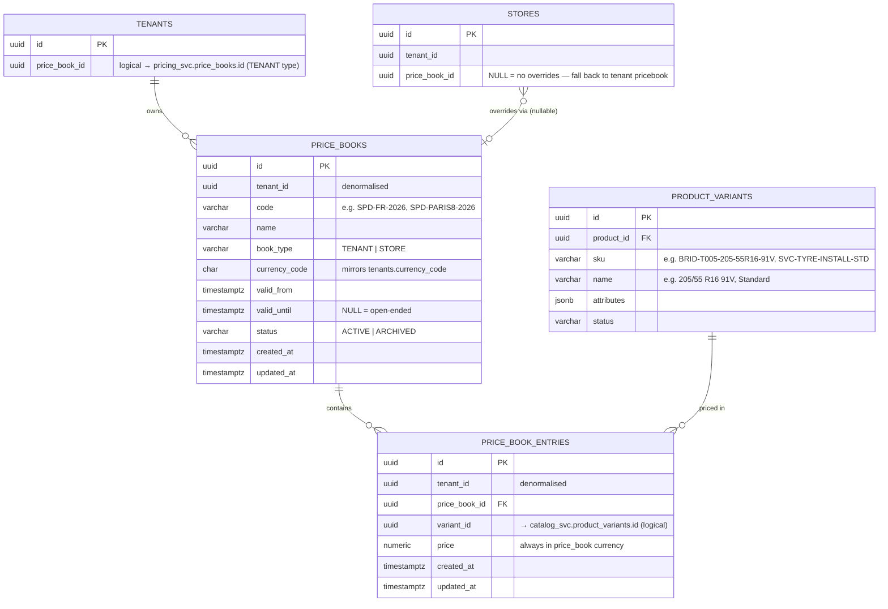

# Pricing Domain — ER Diagram

## Design Rules

| Rule | Implementation |
|---|---|
| All prices are variant-based | `price_book_entries (price_book_id, variant_id)` — every article type (TIRE, PART, LABOR, FEE) has at least one variant |
| Every article has at least one variant | Single-article LABOR/FEE use one auto-created variant row — same lookup path as multi-variant TIREs |
| One currency per tenant | `price_books.currency_code` mirrors `tenants.currency_code` — no conversion |
| Two pricebook types | `TENANT` = full price list; `STORE` = sparse overrides only |
| Date-effective pricing | `price_books.valid_from` / `valid_until` — activate next season by creating a new book |
| Store pricebook is optional | `stores.price_book_id NULL` = no overrides, always use tenant pricebook |
| Multiple stores can share a store pricebook | `stores.price_book_id FK` → many stores can point to the same book |
| Two-tier fallback at checkout | Store pricebook → Tenant pricebook |
| No compare-at price | Handled by promotions service |

---

## Pricing Lookup at Checkout

```
1. If store.price_book_id IS NOT NULL:
      look up price_book_entries WHERE price_book_id = store.price_book_id
                                   AND variant_id    = selected_variant
                                   AND book.valid_from <= now() <= book.valid_until
      → if row found: use this price (store override)

2. Fall back to tenant pricebook:
      look up price_book_entries WHERE price_book_id = tenant.price_book_id (TENANT type, active)
                                   AND variant_id    = selected_variant
      → always has a row (tenant pricebook must be complete)
```

---

## Real-World Example — Speedy France

**Tenant pricebook:** `SPD-FR-2026` — one row per variant, covers all stores by default.

**Store pricebook:** `SPD-PARIS8-2026` — Paris 8th District only, sparse overrides.

| Variant | Tenant price | Paris 8th override | Checkout price (Paris 8th) |
|---|---|---|---|
| Bridgestone T005 205/55 R16 91V | €205.99 | — | €205.99 |
| Bridgestone T005 225/45 R17 94Y | €219.99 | — | €219.99 |
| Tyre Installation Package       | € 45.00 | €55.00 | € 55.00 |
| Tyre Recycling Fee              | €  4.25 | — | €  4.25 |
| State Environmental Fee         | €  1.00 | — | €  1.00 |
| Tyre Protection Warranty        | €  9.99 | — | €  9.99 |

Paris 1st and Lyon stores have `price_book_id = NULL` → always use tenant prices.

---

## ER Diagram



---

## Key Design Decisions

### All articles have at least one variant
Every product type — TIRE, PART, LABOR, FEE, BUNDLE — has at least one row in `product_variants`. This means the pricing service always resolves price via `variant_id`, with no special-case logic for LABOR or FEE. A single-option LABOR like `SVC-TYRE-INSTALL` has one variant `SVC-TYRE-INSTALL-STD`; if a future variant is needed (e.g. premium installation) it's just another row.

### Store pricebook is sparse by design
A store pricebook only contains rows where the store price differs from the tenant price. At checkout the pricing service does at most two lookups. Keeping store books sparse means adding a new product to the tenant catalog automatically makes it available at the right price everywhere — no need to update every store book.

### Date range on the price book, not the entry
To change prices for a new season: create a new `TENANT` pricebook with `valid_from = season start`, copy and adjust entries. The old book remains `ACTIVE` until its `valid_until` passes. This gives a clean cutover with full audit history. Individual entry expiry is not supported — if a single price needs to change mid-book, create a new book.

### `stores.price_book_id` is a logical reference
No FK constraint across service schemas (pool model). The pricing service is the authority on pricebooks; the tenant service holds the pointer. Referential integrity is enforced at the application layer.

---

## Cross-Domain References (logical — no FK constraints across services)

| Column | Points To | Owned By |
|---|---|---|
| `price_books.tenant_id` | `tenant_svc.tenants.id` | Tenant service |
| `price_book_entries.variant_id` | `catalog_svc.product_variants.id` | Catalog service |
| `stores.price_book_id` | `pricing_svc.price_books.id` | Pricing service |

---

## Pricing Service API Surface (planned)

| Operation | Notes |
|---|---|
| `GET /price?variantId=&storeId=` | Returns effective price — store override or tenant fallback |
| `GET /price-books?tenantId=&type=TENANT` | List active tenant pricebooks |
| `GET /price-books/{id}/entries` | All entries in a pricebook |
| `POST /price-books` | Create a new pricebook (new season, new store group) |
| `PUT /price-books/{id}/entries` | Bulk upsert entries |
