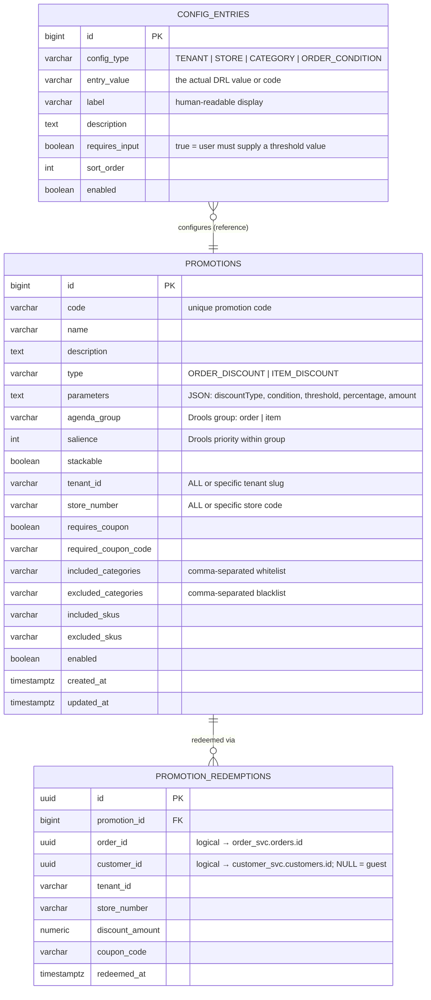

# Promotion Domain — ER Diagram

## Design Rules

| Rule | Implementation |
|---|---|
| One promotion definition per `code` | `promotions.code` unique |
| Tenant scope: `ALL` or specific tenant | `promotions.tenant_id` — default `'ALL'` means any tenant |
| Store scope: `ALL` or specific store | `promotions.store_number` — default `'ALL'` means any store |
| Coupon-gated promotions | `requires_coupon = true` + `required_coupon_code` |
| SKU / category allow-lists and block-lists | `included_skus`, `excluded_skus`, `included_categories`, `excluded_categories` (comma-separated) |
| Drools agenda groups control evaluation order | `agenda_group` = `'order'` or `'item'`; `salience` controls priority within a group |
| Every redemption is audited | `promotion_redemptions` row written per order per promotion applied |
| Config entries are reference data for the UI | `config_entries` drives dropdowns: tenants, stores, categories, order conditions |

---

## ER Diagram

---

## Key Design Decisions

### `parameters` column is a JSON blob
The promotion engine uses Drools DRL templates that read `parameters` at rule-compile time. Keeping it as `TEXT` (JSON) avoids schema migrations every time a new discount strategy is added. The UI form controls which keys are relevant per `type`.

### Drools pipeline: agenda groups + salience
- `agenda_group = 'order'` → evaluated against the whole cart (`totalAmount`, `totalItemCount`, customer flags)
- `agenda_group = 'item'` → evaluated per `CartItem` (`category`, `sku`)
- Higher `salience` fires first within a group; non-stackable promotions cancel lower-priority ones

### `tenant_id = 'ALL'` and `store_number = 'ALL'`
National promotions use `'ALL'` as a wildcard. The Drools filter checks `(promo.tenantId == 'ALL' || promo.tenantId == cart.tenantId)` and likewise for store. This means a Speedy-specific promo (`tenant_id = 'SPEEDY_FR'`) never fires for a different tenant.

### Redemption audit trail
`promotion_redemptions` is append-only. It enables:
- Per-customer redemption counts (coupon-once-per-customer logic)
- Revenue-impact reporting per promotion
- Rollback: cancelling an order can zero out redemption records

---

## Microservice Boundary

| Service | Tables |
|---|---|
| **Promotion service** | `promotions`, `config_entries`, `promotion_redemptions` |

Cross-service references (logical — no DB-level FK constraints):

| Column | Points To | Owned By |
|---|---|---|
| `promotion_redemptions.order_id` | `order_svc.orders.id` | Order service |
| `promotion_redemptions.customer_id` | `customer_svc.customers.id` | Customer service |
