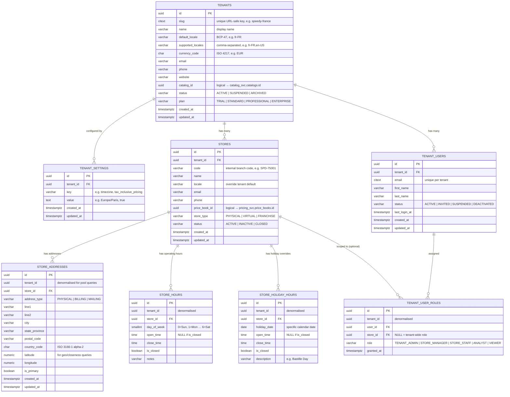

# Tenant Domain — ER Diagram

## Pool DB Model

All microservices share a single PostgreSQL instance (pool model). Each service owns its own **schema**. Every table outside `tenant_svc` carries a `tenant_id` column as a logical reference — there are no cross-schema FK constraints. Isolation is enforced at the application layer (every query filters by `tenant_id`).

```
PostgreSQL (pool DB)
├── tenant_svc     ← this document
├── catalog_svc    ← references tenant_id
├── pricing_svc    ← references tenant_id
├── customer_svc   ← references tenant_id
├── order_svc      ← references tenant_id
└── promotion_svc  ← references tenant_id
```

---

## Design Rules

| Rule | Implementation |
|---|---|
| One slug per tenant | `tenants.slug` unique — used in URLs and service routing |
| Multi-locale per tenant | `supported_locales` comma-separated; `default_locale` for fallback |
| Product catalog is a reference only | `tenants.catalog_id` → `catalog_svc.catalogs.id` (logical, no FK) |
| Store has its own locale override | `stores.locale` overrides `tenants.default_locale` |
| Store address is separate | `store_addresses` — a store can have PHYSICAL + BILLING addresses |
| Geo coordinates on address | `latitude` / `longitude` for closeness / radius queries |
| Operating hours per day-of-week | `store_hours` — one row per day; `is_closed = true` for closed days |
| Holiday hours override regular hours | `store_holiday_hours` — checked before `store_hours` |
| Back-office users are tenant-scoped | `tenant_users` — separate from `customer_svc` end-customers |
| Role can be tenant-wide or store-scoped | `tenant_user_roles.store_id` NULL = tenant-wide; set = store-level |
| Flexible config without schema changes | `tenant_settings` key-value — timezone, tax rules, feature flags |

---

## ER Diagram



---

## Key Design Decisions

### Pool DB — `tenant_id` everywhere
Each microservice schema lives in the same Postgres instance but is completely isolated by schema name. Every table (except `tenants` itself) carries `tenant_id` as a denormalised column. This allows:
- Efficient tenant-scoped queries without joins
- Row-level security (RLS) policies per schema if needed
- Easy future migration to separate databases per tenant (just filter by `tenant_id`)

### `catalog_id` is a logical reference, not a FK
The product catalog lives in `catalog_svc` (separate schema, separate microservice). `tenants.catalog_id` stores the UUID as a plain column — no DB-level FK. The catalog service is the authority; the tenant service just holds the pointer.

### `store_addresses` is a separate table
A store can have multiple address types (physical location, billing, mailing). Keeping addresses separate avoids nullable columns on `stores` and supports future address history.

### Geo coordinates on `store_addresses`
`latitude` / `longitude` on `store_addresses` enables proximity queries (find stores near a customer). The index on `(latitude, longitude)` supports basic bounding-box queries; upgrade to PostGIS `geography` type for accurate radius searches.

### Hours: regular + holiday override
- `store_hours` — the weekly schedule (one row per day-of-week per store)
- `store_holiday_hours` — date-specific overrides checked first
- Application logic: check `store_holiday_hours` for today's date; fall back to `store_hours` for day-of-week

### `tenant_users` vs `customer_svc.customers`
- `tenant_users` = back-office operators (admins, store managers) — created by tenant admin
- `customer_svc.customers` = end-customers who shop — self-registered or imported
These are deliberately in different services with different auth flows.

### Role scoping
`tenant_user_roles.store_id = NULL` → tenant-wide authority (e.g. `TENANT_ADMIN`)
`tenant_user_roles.store_id = <id>` → permission limited to that store (e.g. `STORE_MANAGER`)
A user can hold multiple roles across multiple stores simultaneously.

---

## Cross-Domain References (logical — no FK constraints across services)

| Column | Points To | Owned By |
|---|---|---|
| `tenants.catalog_id` | `catalog_svc.catalogs.id` | Catalog service |
| `stores.price_book_id` | `pricing_svc.price_books.id` | Pricing service |

---

## Tenant Service API Surface (planned)

| Operation | Notes |
|---|---|
| `GET /tenants/{slug}` | Resolve tenant by slug (used by API gateway for routing) |
| `GET /tenants/{id}/stores` | List stores for a tenant |
| `GET /stores/{id}/hours?date=` | Returns effective hours for a date (holiday override + regular) |
| `GET /stores/nearby?lat=&lng=&radius=` | Proximity search using coordinates |
| `POST /tenants` | Onboard a new tenant |
| `PUT /tenants/{id}/settings/{key}` | Update a single config value |
